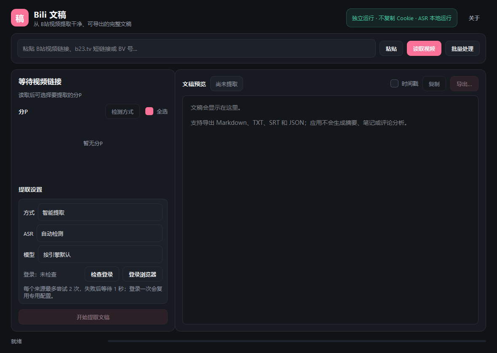

# Bili 文稿

一个只做 **B站视频文稿提取** 的 Windows 桌面应用。没有摘要、笔记、评论分析或知识库归档；读取链接、选择分P、提取文稿、预览并导出。



## 提取顺序

应用把提取策略写成固定顺序，不依赖 Codex、浏览器插件或外部代理：

1. 请求 `/x/player/v2`，优先读取 B站公开字幕；
2. 请求匿名 `/x/player/wbi/v2`，处理公开接口只给出 `ai-zh` 元数据的情况；
3. 前两步没有有效中文字幕时，通过应用自行启动的专用 Edge / Chrome / Brave 登录窗口请求播放器 AI 字幕；
4. 所有 B站字幕都不可得时，才下载音频并调用本机 ASR 或配置的 API ASR；
5. 只保留文稿结果，临时音频会在任务结束后删除。

每个来源最多尝试 **2 次**。第一次请求失败、没有字幕 URL、字幕正文下载失败或正文为空时，固定等待 **1 秒**再试；第二次仍失败才进入下一来源。智能排序为：

```text
人工中文字幕 → B站中文 AI 字幕 → 其他 B站字幕 → 本地 ASR
```

公开英文字幕只会暂存为后备，不会再挡住匿名接口或登录浏览器中的中文 AI 字幕。

专用登录浏览器使用固定本地端口 `39271` 和独立配置目录 `%LOCALAPPDATA%\BiliTranscript\browser-profile`。B站页面在浏览器进程中自行发起带登录状态的请求；Python 进程只接收字幕接口结果，不读取、解密或复制 Cookie，也不会接触用户日常浏览器的默认配置。

### 首次获取 B站 AI 字幕

1. 点击应用中的“登录浏览器”；
2. 在打开的专用浏览器窗口中登录 B站；
3. 保持该窗口打开，回到应用读取视频；
4. 回到应用点击“检查登录”，确认显示账号名称；
5. 选择“智能提取”；它会自动包含登录浏览器来源。

登录一次后会复用专用配置。需要退出账号时，直接在该浏览器窗口退出 B站；需要彻底清除状态时，关闭专用浏览器后删除上述 `browser-profile` 目录。

## 检测与手动选源

读取视频后点击“检测方式”，应用会对每个选中分P分别显示：

- `公开✓/×`
- `匿名✓/×`
- `登录✓/×`
- `ASR✓/×`

鼠标停在分P上可以查看失败原因、尝试次数和可下载字幕数量。提取方式可以精确选择：

1. 智能提取
2. 只用公开字幕
3. 只用匿名接口
4. 只用登录浏览器
5. 只用本地 ASR

手动模式不会偷偷下降到其他来源。例如选择“只用匿名接口”时，不会请求公开字幕、登录浏览器或 ASR。

## 批量提取

点击主界面的“批量处理”，把包含多条 B站链接、BV 号、av 号或混合说明文字的内容一次粘贴进去。应用会自动识别、按出现顺序去重，并行读取每个视频的全部分P；单个视频失败不会中断其他任务。

批量任务沿用当前窗口的提取方式和 ASR 设置，默认并行 3 个视频，可调整为 1–4 个。选择导出目录后点击“开始批量提取”，每个成功视频会自动写成独立文件：

```text
视频标题__BVxxxxxxxxxxx.md
```

主界面的“粘贴”按钮检测到剪贴板中有多条链接时，也会直接打开批量窗口。批量模式只自动导出 Markdown，不会覆盖已有同名文件；重复文件会追加序号。

## 功能

- 支持完整 B站链接、`b23.tv` 短链接、BV 号和 av 号
- 支持从混合文本批量识别链接，并行提取后分别导出 Markdown
- 多分P勾选与部分成功保留
- 每分P四来源可用性检测与明确失败原因
- 五种模式：智能、公开、匿名、登录浏览器、ASR（本地引擎或 API）
- 支持 OpenAI 兼容 ASR API，可接入 CrisperWeaver / MiMo 等本地服务
- 独立发现并启动 Microsoft Edge、Google Chrome 或 Brave，不依赖 Codex
- 可选 Faster-Whisper、FunASR / SenseVoice、OpenAI Whisper
- 文稿预览可切换时间戳
- 导出 Markdown、TXT、SRT、JSON
- B站和 API 请求仅使用 Python 标准库；本地 ASR 在独立 Python 进程运行
- 提取期间可取消；临时音频不持久化，登录状态仅保存在专用浏览器配置中

## 直接运行源码

需要 Python 3.11–3.13。

```powershell
cd BiliTranscript
python -m venv .venv
.\.venv\Scripts\python.exe -m pip install -r requirements.txt
.\.venv\Scripts\python.exe bilitranscript.py
```

只有公开视频字幕时不需要任何 ASR 依赖。

## 启用本地 ASR

推荐把 Faster-Whisper 安装到 PATH 中的 Python：

```powershell
python -m pip install -r requirements-asr.txt
```

应用启动转写时会依次检查当前 Python、`python`、`python3`，找到已有的 ASR 后端后再调用它。默认优先级是 Faster-Whisper → FunASR → OpenAI Whisper。

- Faster-Whisper：推荐，能直接读取下载的音频，默认 `small` 模型。
- FunASR / SenseVoice：中文可选，默认 `iic/SenseVoiceSmall`；需要 PATH 中存在 `ffmpeg`。
- OpenAI Whisper：兼容选项，需要 PATH 中存在 `ffmpeg`。

模型由对应 ASR 库在首次使用时下载到其默认缓存目录。应用本身不携带模型。

## 使用 OpenAI 兼容 API ASR

在软件中选择“只用 ASR”或“智能提取”，将 ASR 后端切换为“OpenAI 兼容 API（MiMo）”，点击“API 设置…”确认地址和密钥。默认配置为：

```text
Base URL: http://127.0.0.1:8765/v1
API Key:  local
模型:     mimo-asr
语言:     zh
```

以 CrisperWeaver 为例，需要先在它的设置中加载 MiMo 模型，并打开“本地 HTTP 服务器（OpenAI 兼容）→运行服务器”。应用的“测试连接”会请求 `http://127.0.0.1:8765/health`；服务必须保持运行。

应用使用 `POST /v1/audio/transcriptions`，以 multipart 方式发送 `file`、`model`、`language=zh` 和 `response_format=verbose_json`，兼容返回带 `segments` 的 JSON 和只返回 `text` 的服务。B站下载的 `.m4s` 音频会先转换为 WAV，因此 API ASR 需要 PATH 中存在 `ffmpeg`。

API 后端不读取或加载模型，`model` 参数只是兼容 OpenAI 格式，实际使用 API 服务中已经加载的模型。为符合 CrisperWeaver 的限制，同一时间的 API 转录请求会在应用内串行处理；批量任务仍可并行下载和处理其他非 API 来源。

选择“自动检测”时，应用优先使用已安装的本地 ASR；本地引擎不可用时会自动尝试上述 API 服务。手动选择 API 后则只调用 API，不会启动本地 Python ASR。

## Windows 安装版与便携版

普通用户推荐从 [Releases](https://github.com/W1nge/BiliTranscript/releases) 下载安装版：

```text
BiliTranscript-0.5.0-setup-win-x64.exe
```

安装版默认安装到当前用户的程序目录，无需管理员权限；它会创建开始菜单入口，并可选创建桌面快捷方式，同时提供标准卸载程序。卸载应用不会删除 `%LOCALAPPDATA%\BiliTranscript\browser-profile` 中的专用浏览器登录资料。

构建安装版需要先安装 Inno Setup 6 或 7：

```powershell
build-installer.bat
```

只构建便携目录时运行：

```powershell
build.bat
```

安装器输出为 `dist\BiliTranscript-0.5.0-setup-win-x64.exe`，便携版输出位于 `dist\BiliTranscript\BiliTranscript.exe`。两者都包含桌面界面和字幕提取核心，不内置大型 ASR 模型；应用会调用电脑上已有的 ASR Python 环境。

## 测试

```powershell
python -m unittest discover -s tests -v
.\.venv\Scripts\python.exe bilitranscript.py --smoke-test
```

测试使用本地假数据，不访问 B站。

## 边界与合规

- 仅适用于当前账号或公开页面有权观看的内容。
- 请尊重视频作者、字幕作者的版权和 B站服务条款，不要批量抓取、重新发布或绕过访问控制。
- B站接口和风控策略可能变化；出现 HTTP 412 时请稍后再试或切换网络。
- AI 字幕与 ASR 都可能识别错专有名词，导出前建议人工校对。

项目采用 MIT 许可。参考来源与第三方声明见 [NOTICE.md](NOTICE.md)。
