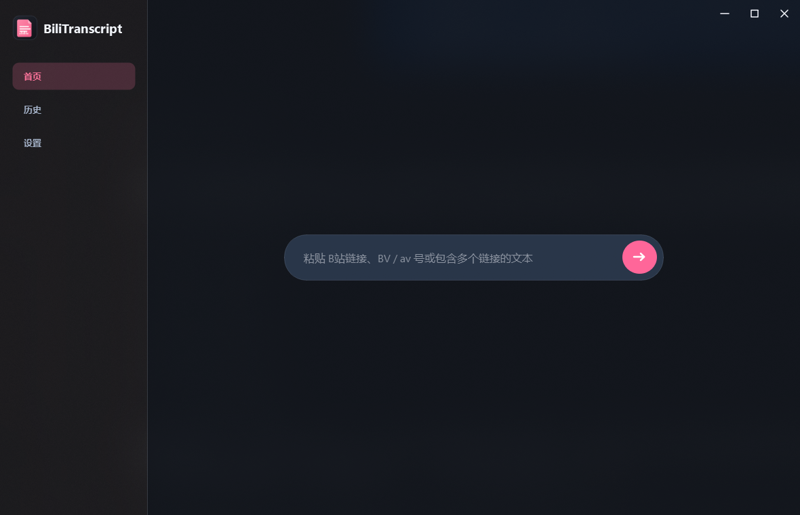
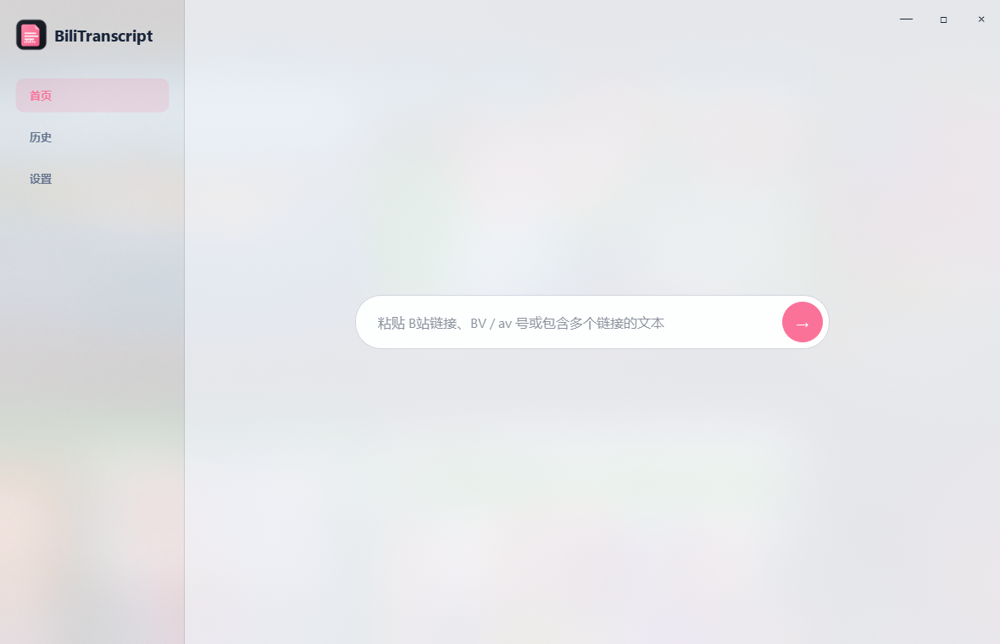

# Bili 文稿

一个只做 **B站视频文稿提取** 的 Windows 桌面应用。没有摘要、笔记、评论分析或知识库归档；粘贴链接即可自动提取全部分P、预览并导出，也可以通过局域网 REST API 被其他软件调用。



浅色主题预览：

## 提取顺序

应用把提取策略写成固定顺序，不依赖 Codex、浏览器插件或外部代理：

1. 请求 `/x/player/v2`，优先读取 B站公开字幕；
2. 请求匿名 `/x/player/wbi/v2`，处理公开接口只给出 `ai-zh` 元数据的情况；
3. 前两步没有有效中文字幕时，通过应用自行启动的专用 Edge / Chrome / Brave 登录窗口请求播放器 AI 字幕；
4. 所有 B站字幕都不可得时，才下载音频并调用本机 ASR 或配置的 API ASR；
5. 只保留文稿结果，临时音频会在任务结束后删除。

每个来源最多尝试 **2 次**。第一次请求失败、没有字幕 URL、字幕正文下载失败或正文为空时，固定等待 **1 秒**再试；第二次仍失败才进入下一来源。智能排序为：

```text
人工中文字幕 → B站中文 AI 字幕 → 其他 B站字幕 → 本地 ASR
```

公开英文字幕只会暂存为后备，不会再挡住匿名接口或登录浏览器中的中文 AI 字幕。

专用登录浏览器使用固定本地端口 `39271` 和独立配置目录 `%LOCALAPPDATA%\BiliTranscript\browser-profile`。B站页面在浏览器进程中自行发起带登录状态的请求；Python 进程只接收字幕接口结果，不读取、解密或复制 Cookie，也不会接触用户日常浏览器的默认配置。

### 首次获取 B站 AI 字幕

1. 打开应用；软件会自动启动专用浏览器并自动检查登录状态；
2. 首次使用时，在打开的专用浏览器窗口中登录 B站；软件会自动发现登录成功，无需再点“检查登录”；
3. 保持该窗口打开，回到应用粘贴视频链接；
4. 在设置 → 提取中保持“智能提取”，应用会自动包含登录浏览器来源。

登录一次后会复用专用配置，以后打开应用会直接验证已有登录状态，不会读取或自动填写账号密码。需要退出账号时，直接在该浏览器窗口退出 B站；需要彻底清除状态时，关闭专用浏览器后删除上述 `browser-profile` 目录。

## 极简桌面界面

主窗口使用简洁标题栏和 Windows Acrylic 玻璃材质，侧栏只有“首页 / 历史 / 设置”。首页空闲时只保留一个输入框：按 Enter 或右侧箭头提交，支持 BV/av、完整链接、b23.tv 和混合多链接文本。单个视频自动读取信息后提取全部分P；多条链接自动并行提取并分别导出到 `文档\\Bili文稿`。结果页提供复制、导出和“提取下一个”，设置、账号、ASR、API 和历史管理全部集中在设置/历史页面。

主题可选跟随系统、浅色或深色。Acrylic 由窗口后方的单一 Windows Composition 背景层完成，不使用截图、软件高斯模糊或刷新轮询；透明效果关闭、高对比度、节电模式或系统合成不可用时自动回退为实色背景。

## 检测与手动选源

在设置 → 提取中可以选择“智能提取”或手动来源。展开“来源诊断”，输入一个视频后即可真正检测全部分P；工具会分别显示：

- `公开✓/×`
- `匿名✓/×`
- `登录✓/×`
- `ASR✓/×`

每条结果会直接给出可用状态、实际尝试次数、可下载字幕数量和失败原因。检测可随时取消。提取方式可以精确选择：

1. 智能提取
2. 只用公开字幕
3. 只用匿名接口
4. 只用登录浏览器
5. 只用 ASR

手动模式不会偷偷下降到其他来源。例如选择“只用匿名接口”时，不会请求公开字幕、登录浏览器或 ASR。

## 批量提取

把包含多条 B站链接、BV 号、av 号或混合说明文字的内容一次粘贴到首页输入框即可。应用会自动识别、按出现顺序去重，并行读取每个视频的全部分P；单个视频失败不会中断其他任务。

批量任务沿用提交瞬间的提取方式和 ASR 设置，默认并行 3 个视频，可调整为 1–4 个。每个成功视频会自动写入默认目录（首次为 `文档\\Bili文稿`）：

```text
视频标题__BVxxxxxxxxxxx.md
```

批量模式只自动导出 Markdown，不会覆盖已有同名文件；重复文件会追加序号。

## 局域网提取 API

完整的接口定义、错误码和 PowerShell/Python 调用示例见 [API 调用说明](API.md)。

提取 API 默认随软件启动；可在设置 → 提取 API 中随时停止运行或关闭“随软件启动”，并在同一页面查看状态、复制密钥或修改端口。首次启动时生成随机 API Key。服务默认监听：

```text
http://0.0.0.0:8766
```

`0.0.0.0` 是监听地址，调用时应使用设置窗口显示的实际本机或局域网地址，例如 `http://192.168.1.20:8766`。关闭桌面软件后，提取 API 同时停止。

设置 → 常规中的“开机自启”可将 Bili 文稿加入当前 Windows 用户的登录启动项，无需管理员权限。

提取 API 和 ASR API 是两个不同的服务：

- `8766`：Bili 文稿向其他软件提供的文稿提取 API；
- `8765`：CrisperWeaver / MiMo 等可选的上游 ASR API。

除 `/health` 和 `/openapi.json` 外，所有 `/v1` 接口都需要：

```text
Authorization: Bearer YOUR_API_KEY
```

提交一个视频：

```powershell
$base = "http://127.0.0.1:8766"
$key = "YOUR_API_KEY"

$job = curl.exe -s -X POST "$base/v1/extractions" `
  -H "Authorization: Bearer $key" `
  -H "Content-Type: application/json" `
  -d '{"source":"BVxxxxxxxxxxx"}' | ConvertFrom-Json

curl.exe -s "$base/v1/extractions/$($job.id)" `
  -H "Authorization: Bearer $key"

curl.exe -s "$base/v1/extractions/$($job.id)/result?format=markdown&timestamps=true" `
  -H "Authorization: Bearer $key"
```

Python 标准库调用：

```python
import json
import time
import urllib.request

base = "http://127.0.0.1:8766"
api_key = "YOUR_API_KEY"


def api_json(path, method="GET", payload=None):
    data = json.dumps(payload).encode("utf-8") if payload is not None else None
    request = urllib.request.Request(
        base + path,
        data=data,
        method=method,
        headers={
            "Authorization": f"Bearer {api_key}",
            "Content-Type": "application/json",
        },
    )
    with urllib.request.urlopen(request) as response:
        return json.load(response)


job = api_json("/v1/extractions", "POST", {"source": "BVxxxxxxxxxxx"})
while True:
    status = api_json(f"/v1/extractions/{job['id']}")
    if status["status"] in {"succeeded", "failed", "cancelled"}:
        break
    time.sleep(1)

if status["status"] == "succeeded":
    request = urllib.request.Request(
        base + f"/v1/extractions/{job['id']}/result?format=markdown",
        headers={"Authorization": f"Bearer {api_key}"},
    )
    with urllib.request.urlopen(request) as response:
        print(response.read().decode("utf-8"))
else:
    print(status)
```

`POST /v1/extractions` 会立即返回任务 ID。调用方轮询 `GET /v1/extractions/{id}`，直到状态变成 `succeeded`、`failed` 或 `cancelled`，再读取结果。可用接口如下：

| 方法 | 路径 | 说明 |
| --- | --- | --- |
| `GET` | `/health` | 无鉴权健康检查 |
| `GET` | `/openapi.json` | OpenAPI 3.1 规范 |
| `GET` | `/v1/capabilities` | 当前非敏感提取设置和服务限制 |
| `POST` | `/v1/extractions` | 提交一个视频提取任务 |
| `GET` | `/v1/extractions/{id}` | 查询状态和进度 |
| `GET` | `/v1/extractions/{id}/result` | 获取 `json`、`markdown`、`text` 或 `srt` 结果 |
| `POST` | `/v1/extractions/{id}/cancel` | 取消任务，可重复调用 |

每个 API 任务提取视频的全部分P，并在提交瞬间保存桌面界面的提取方式、ASR 后端、模型及上游 ASR 设置；之后修改界面设置不会影响已经提交的任务。最多同时运行 3 个任务、保留 32 个未完成任务，完成结果只在内存中保留 1 小时。JSON 结果沿用应用导出的 schema，并用 `has_issues` 和 `issues` 表示部分分P失败。

这是可信局域网 HTTP 服务，不提供内置 HTTPS，也不开放浏览器 CORS。不要把端口直接映射到公网；网页应用应由后端代理调用。其他设备无法连接时，请在 Windows 防火墙中允许 `BiliTranscript.exe` 的专用网络访问。应用不会自动修改防火墙规则。

## 功能

- 支持完整 B站链接、`b23.tv` 短链接、BV 号和 av 号
- 支持从混合文本批量识别链接，并行提取后分别导出 Markdown
- 支持带 Bearer API Key 的局域网异步提取 API
- 自动提取视频全部分P，并保留部分成功结果
- 设置中的来源诊断与固定降级规则
- 五种模式：智能、公开、匿名、登录浏览器、ASR（本地引擎或 API）
- 支持 OpenAI 兼容 ASR API，可接入 CrisperWeaver / MiMo 等本地服务
- 独立发现并启动 Microsoft Edge、Google Chrome 或 Brave，不依赖 Codex
- 可选 Faster-Whisper、FunASR / SenseVoice、OpenAI Whisper
- 设置中可设定文稿时间戳
- 导出 Markdown、TXT、SRT、JSON
- SQLite 历史永久保留，支持主页/API 分组、搜索、分页和按需加载正文
- 系统/浅色/深色 Acrylic 主题及透明效果实色回退
- B站和 API 请求仅使用 Python 标准库；本地 ASR 在独立 Python 进程运行
- 提取期间可取消；临时音频不持久化，登录状态仅保存在专用浏览器配置中

历史数据库位于 `%LOCALAPPDATA%\\BiliTranscript\\history.sqlite3`，不会保存 API Key、ASR Key 或上游地址。

## 直接运行源码

需要 Python 3.11–3.13。

```powershell
cd BiliTranscript
python -m venv .venv
.\.venv\Scripts\python.exe -m pip install -r requirements.txt
.\.venv\Scripts\python.exe bilitranscript.py
```

只有公开视频字幕时不需要任何 ASR 依赖。

## 启用本地 ASR

推荐把 Faster-Whisper 安装到 PATH 中的 Python：

```powershell
python -m pip install -r requirements-asr.txt
```

应用启动转写时会依次检查当前 Python、`python`、`python3`，找到已有的 ASR 后端后再调用它。默认优先级是 Faster-Whisper → FunASR → OpenAI Whisper。

- Faster-Whisper：推荐，能直接读取下载的音频，默认 `small` 模型。
- FunASR / SenseVoice：中文可选，默认 `iic/SenseVoiceSmall`；需要 PATH 中存在 `ffmpeg`。
- OpenAI Whisper：兼容选项，需要 PATH 中存在 `ffmpeg`。

模型由对应 ASR 库在首次使用时下载到其默认缓存目录。应用本身不携带模型。

## 使用 OpenAI 兼容 API ASR

在设置 → 提取中选择“只用 ASR”或“智能提取”，将 ASR 后端切换为“OpenAI 兼容 API（MiMo）”；然后在设置 → ASR 中应用地址和密钥。默认配置为：

```text
Base URL: http://127.0.0.1:8765/v1
API Key:  local
模型:     mimo-asr
语言:     zh
```

以 CrisperWeaver 为例，需要先在它的设置中加载 MiMo 模型，并打开“本地 HTTP 服务器（OpenAI 兼容）→运行服务器”。应用的“测试连接”会请求 `http://127.0.0.1:8765/health`；服务必须保持运行。

应用使用 `POST /v1/audio/transcriptions`，以 multipart 方式发送 `file`、`model`、`language=zh` 和 `response_format=verbose_json`，兼容返回带 `segments` 的 JSON 和只返回 `text` 的服务。B站下载的 `.m4s` 音频会先转换为 WAV，因此 API ASR 需要 PATH 中存在 `ffmpeg`。

API 后端不读取或加载模型，`model` 参数只是兼容 OpenAI 格式，实际使用 API 服务中已经加载的模型。为符合 CrisperWeaver 的限制，同一时间的 API 转录请求会在应用内串行处理；批量任务仍可并行下载和处理其他非 API 来源。

API 音频转录的默认总超时为 **1 小时（3600 秒）**；健康检查仍为 8 秒，连接建立仍为 15 秒。

选择“自动检测”时，应用优先使用已安装的本地 ASR；本地引擎不可用时会自动尝试上述 API 服务。手动选择 API 后则只调用 API，不会启动本地 Python ASR。

## Windows 安装版与便携版

普通用户推荐从 [Releases](https://github.com/W1nge/BiliTranscript/releases) 下载安装版：

```text
BiliTranscript-1.0.0-setup-win-x64.exe
```

安装版默认安装到当前用户的程序目录，无需管理员权限；它会创建开始菜单入口，并可选创建桌面快捷方式，同时提供标准卸载程序。卸载应用不会删除 `%LOCALAPPDATA%\BiliTranscript\browser-profile` 中的专用浏览器登录资料。

构建安装版需要先安装 Inno Setup 6 或 7：

```powershell
build-installer.bat
```

只构建便携目录时运行：

```powershell
build.bat
```

安装器输出为 `dist\BiliTranscript-1.0.0-setup-win-x64.exe`，便携版输出为 `dist\BiliTranscript-1.0.0-win-x64.zip`（解压后主程序位于 `BiliTranscript\BiliTranscript.exe`）。两者都包含桌面界面、字幕提取核心、完整 API 文档和局域网提取 API，不内置大型 ASR 模型；应用会调用电脑上已有的 ASR Python 环境。

## 测试

```powershell
python -m unittest discover -s tests -v
.\.venv\Scripts\python.exe bilitranscript.py --smoke-test
```

测试使用本地假数据，不访问 B站。

## 边界与合规

- 仅适用于当前账号或公开页面有权观看的内容。
- 请尊重视频作者、字幕作者的版权和 B站服务条款，不要批量抓取、重新发布或绕过访问控制。
- B站接口和风控策略可能变化；出现 HTTP 412 时请稍后再试或切换网络。
- AI 字幕与 ASR 都可能识别错专有名词，导出前建议人工校对。

项目采用 MIT 许可。参考来源与第三方声明见 [NOTICE.md](NOTICE.md)。
